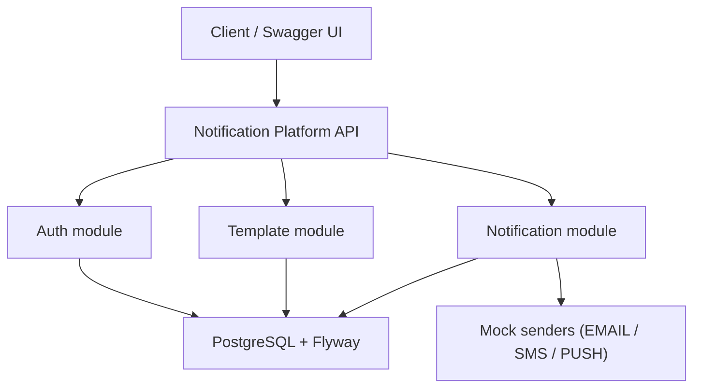

# Notification Delivery Platform • API

[](https://github.com/yusufjon-akhmedov/notification-platform/actions/workflows/ci.yml)

[](https://github.com/yusufjon-akhmedov/notification-platform/actions/workflows/docker.yml)

[](https://github.com/yusufjon-akhmedov/notification-platform/actions/workflows/qodana_code_quality.yml)

> JWT authentication, RBAC, template management, notification lifecycle, mock dispatch, delivery attempt tracking

**Notification Delivery Platform API** is a monolithic REST backend for creating and managing notification
templates, persisting notifications, securing requests with JWT bearer tokens, and simulating delivery execution
without real external providers. It handles user registration and login, role-based access control, template CRUD,
notification create/list/get/cancel flows, mock dispatch with status updates, PostgreSQL persistence via Flyway
migrations, and Swagger UI for interactive API testing.

It is an all-in-one backend service that covers:

- authentication
- template management
- notification creation and filtering
- mock dispatch and delivery history

---

## Project overview - Notification Delivery Platform

**Notification Delivery Platform** models a simple internal notification orchestration backend where authenticated
users can manage templates, create notifications, and inspect delivery state.

**Core workflow:**

* users register and login with JWT-based authentication
* newly registered users receive the `OPERATOR` role by default
* `ADMIN` and `MANAGER` users manage notification templates
* `OPERATOR` users create notifications and can view only their own notifications
* `ADMIN` and `MANAGER` users can view broader notification data
* pending notifications can be cancelled or dispatched through mock senders
* dispatch stores delivery attempts and updates notification status to `SENT` or `FAILED`

**Main modules:**

* **auth**: registration, login, JWT issuance, request authentication
* **template**: template CRUD with pagination, sorting, and filtering
* **notification**: notification create/list/get/cancel/dispatch flows and delivery attempts
* **common**: OpenAPI config, global exception handling, paged responses

---

## Architecture diagram

High-level monolithic architecture overview for the notification platform:



---

## Service scope - Notification Delivery Platform API

* **Authentication** with `register` and `login` endpoints returning JWT bearer tokens.
* **Authorization** with `ADMIN`, `MANAGER`, and `OPERATOR` roles.
* **Template management** where `ADMIN` and `MANAGER` can create, update, and delete templates, while all authenticated roles can read them.
* **Notification management** with creation, paginated listing, detail lookup, and pending-only cancel flow.
* **Ownership rules** where `OPERATOR` users can access only their own notifications, while `ADMIN` and `MANAGER` have broader access.
* **Mock dispatch flow** where delivery is simulated without real providers and notification status becomes `SENT` or `FAILED`.
* **Delivery attempt history** persisted for each dispatch attempt and available through the API.
* **Validation and error handling** using Jakarta Validation and centralized exception responses.
* **Swagger / OpenAPI** documentation for local testing.
* **Flyway migrations** executed automatically at startup.

---

## Tech stack & versions

* **Java** 21
* **Spring Boot** 3.5.13
* **Spring Web**
* **Spring Security**
* **Spring Data JPA**
* **Spring Validation**
* **PostgreSQL**
* **Flyway**
* **JJWT** 0.13.0
* **Springdoc OpenAPI** 2.8.16
* **JUnit 5**
* **Mockito**
* **Testcontainers (PostgreSQL)**
* **Docker** + **Docker Compose**
* **Maven**

All versions are aligned with this service's `pom.xml`.

---

## API documentation

* **Swagger UI**: `http://localhost:8081/swagger-ui/index.html`
* **OpenAPI JSON**: `http://localhost:8081/v3/api-docs`
* **OpenAPI YAML**: `http://localhost:8081/v3/api-docs.yaml`

> Public by security config: `/api/auth/**`, `/actuator/**`, `/swagger-ui/**`, `/v3/api-docs/**`, and
> `/v3/api-docs.yaml`

---

## Main routes

| Path | Methods | Access | Notes |
|-------------------------------|----------------------------|-------------------------------------------|----------------------------------------------------------------|
| `/api/auth/register` | `POST` | **Public** | Register a user with default role `OPERATOR` |
| `/api/auth/login` | `POST` | **Public** | Returns a JWT bearer token |
| `/api/templates` | `GET`, `POST` | `GET` authenticated, `POST` `ADMIN`/`MANAGER` | Supports `page`, `size`, `sort`, `channel`, `active`, and `name` |
| `/api/templates/{id}` | `GET`, `PUT`, `DELETE` | `GET` authenticated, write `ADMIN`/`MANAGER` | Template detail and management |
| `/api/notifications` | `GET`, `POST` | `GET` authenticated with role rules, `POST` `OPERATOR` | Supports `page`, `size`, `sort`, `status`, `channel`, and `recipient` |
| `/api/notifications/{id}` | `GET` | **Authenticated with role/ownership rules** | `OPERATOR` users can access only their own notification |
| `/api/notifications/{id}/cancel` | `PATCH` | **Authenticated with role/ownership rules** | Only `PENDING` notifications can be cancelled |
| `/api/notifications/{id}/dispatch` | `POST` | **Authenticated with role/ownership rules** | Mock dispatch flow updates notification status and creates a delivery attempt |
| `/api/notifications/{id}/attempts` | `GET` | **Authenticated with role/ownership rules** | Returns delivery attempt history for the notification |

---

## Build & run

### A) Local JVM (no container for the app)

Prereqs: Java 21, Docker or PostgreSQL, and a database named `notification_platform`

```bash
# start only PostgreSQL from docker compose
docker compose up -d postgres

# start the API
./mvnw spring-boot:run
```

If you prefer a local PostgreSQL instance instead of Docker, update
[`src/main/resources/application.yaml`](src/main/resources/application.yaml) as needed.

### B) Local Docker

This repo includes [Dockerfile](Dockerfile) and [compose.yaml](compose.yaml).

```bash
docker compose up --build
```

After startup:

* API base URL: `http://localhost:8081`
* Swagger UI: `http://localhost:8081/swagger-ui/index.html`
* OpenAPI JSON: `http://localhost:8081/v3/api-docs`

> Flyway runs automatically on startup using scripts in `src/main/resources/db/migration`.
> Local defaults use database `notification_platform`, username `postgres`, password `postgres`, app port `8081`,
> and PostgreSQL host port `5434`.
> Inside Docker Compose, the app connects to PostgreSQL with
> `jdbc:postgresql://postgres:5432/notification_platform`.

---

## Testing

* **JUnit 5** is used for both unit and integration tests.
* **Mockito** is used in unit tests to mock repositories, `PasswordEncoder`, `AuthenticationManager`, `JwtService`, and sender collaborators.
* Unit tests focus on the service layer: `AuthService`, `NotificationTemplateService`, `NotificationService`, and mock dispatch behavior.
* Integration tests use **Spring Boot Test**, **MockMvc**, and **Testcontainers with PostgreSQL** for a production-like database setup.
* Integration coverage includes authentication, protected API access, template flow, notification flow, ownership rules, dispatch flow, and delivery-attempt persistence.

Run the test suite with:

```bash
mvn test
```

Run only the integration tests with:

```bash
mvn -q -Dtest='*IntegrationTest' test
```

---

## Ports (defaults)

* Notification Delivery Platform API: **8081**
* PostgreSQL host port: **5434**
* PostgreSQL container port: **5432**
